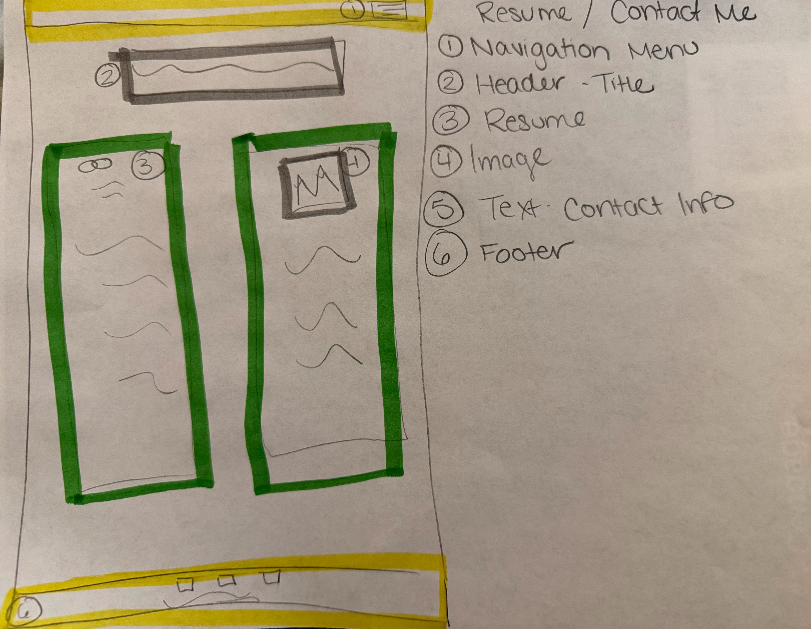

# Maryalice Taneyhill's INF6420 Project

A portfolio site showcasing my work. 

## Wireframes

This is a sketch of how I am planning to construct my portfolio. 

Header - Will include my navigation menu, name, and image

Navigation Menu - Will include links to other pages - my work and contact information

Main Content - Will introduce myself and include images and description.

Footer - will include contact information and links to social media.

Header - Will include navigation menu and page title

Navigation Menu - Will include links to other pages - home and contact information

Main Content - Will include images and descriptions of notable pieces of work 

Footer - will include contact information and links to social media.

Header - Will include my navigation menu, name, and image

Navigation Menu - Will include links to other pages - my work and home page. 

Main Content - My resume and contact information with an image

Footer - will include contact information and links to social media.
